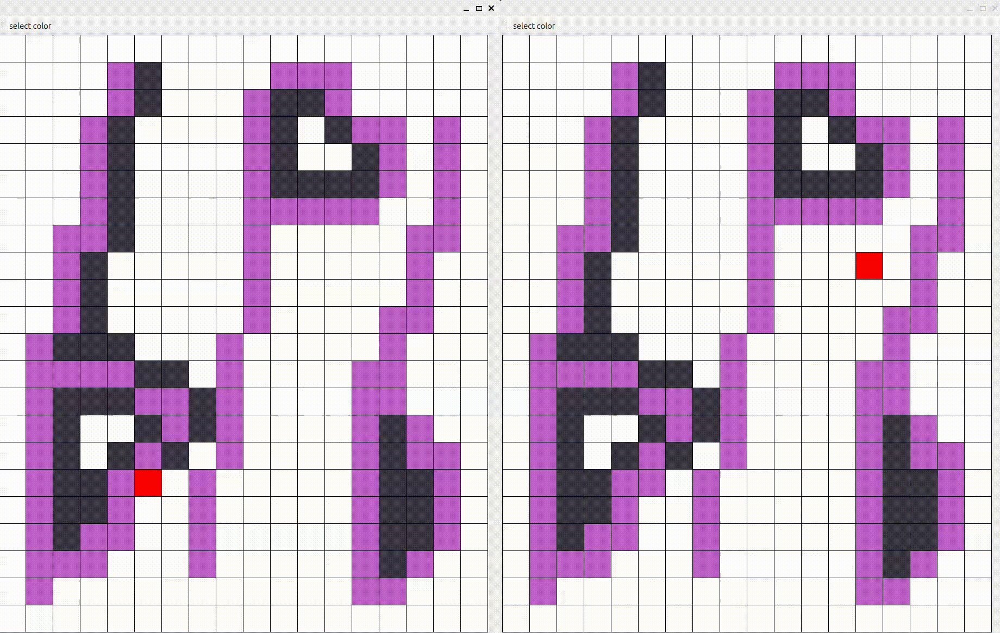
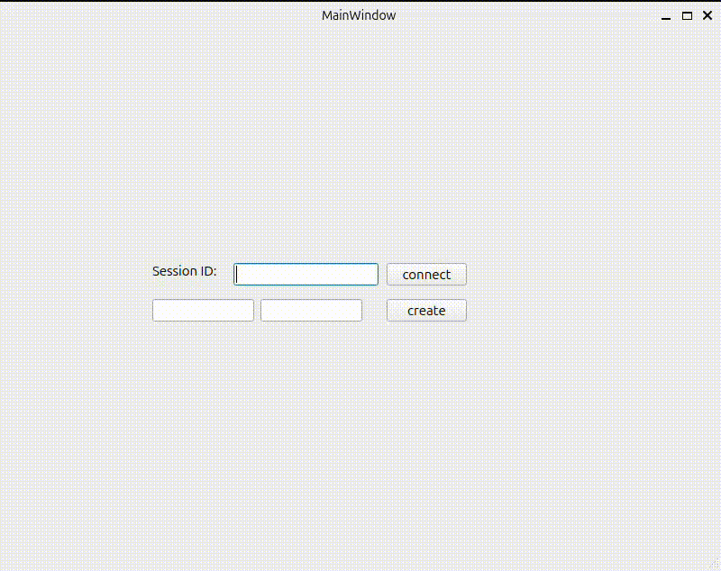
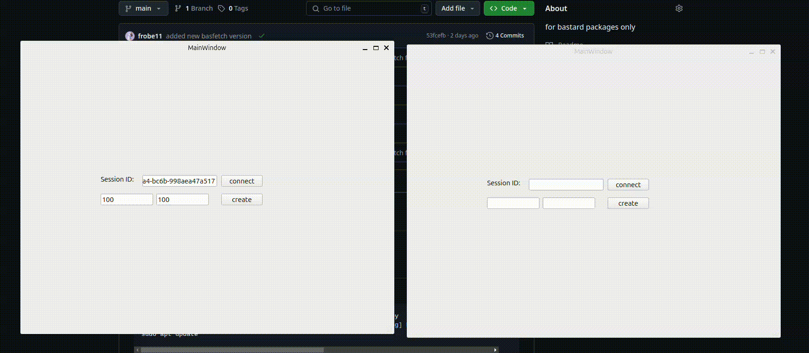

# bastard-pixel-battale

## Description
    Bastard brother of pixel battle without delay, but with bastard net code.


## Client
### .env params
don't forget to copy .env to directory you execute binary from 
- `DOMAIN` - server's ip or domain 
- `PORT` - server's port
### setup
#### manual from sources
```bash
mkdir ./build
cd build
cmake ..
make
sudo ./BastardPixelBattle
```
### how to create new session??

1. you have to specify game field height and width
2. click on create button
3. copy session id from field "Session ID:" (this is last time you see new game's Session id)
4. click on connect button
5. enjoy pixels
### how to connect to session?

1. paste session id
2. click connect putton